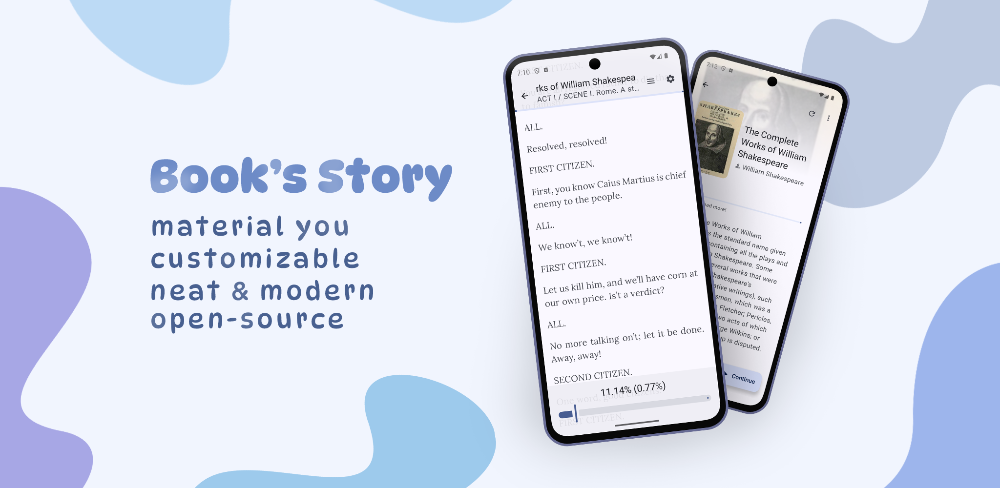
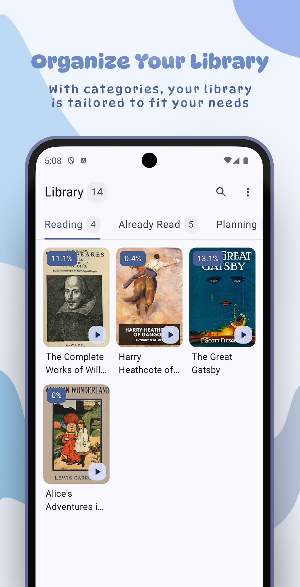
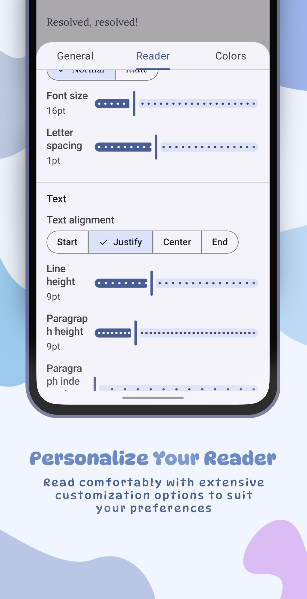
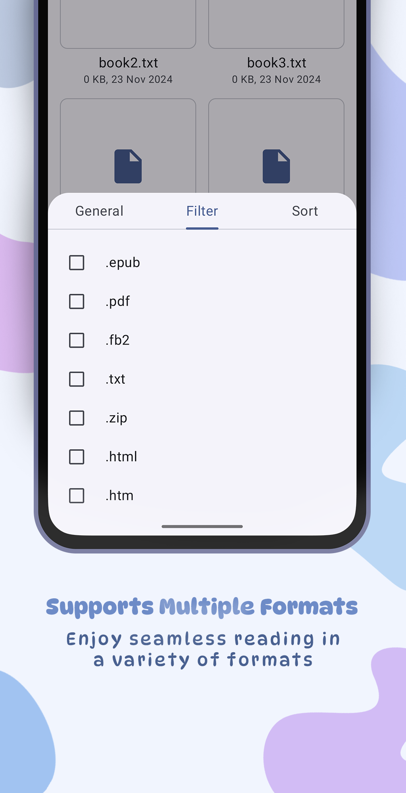
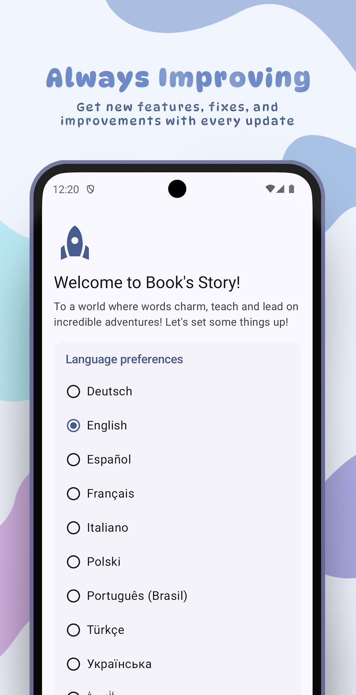
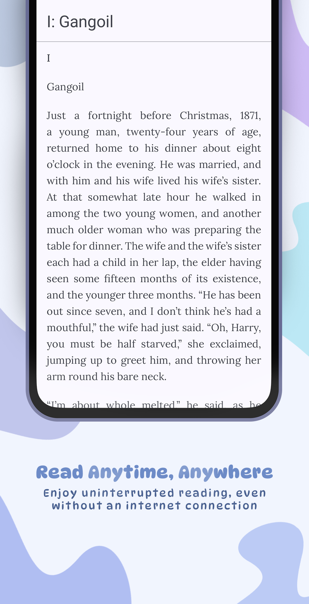

<!------------ Header ------------>

  
  <h1>Book's Story</h1>
  <h3>Material You eBook Reader for Android</h3>
  
Dive into the world of adventure as you discover your favorite book's story!

---

<!------------ Badges ------------>

<a href=""></a>
<a href=""></a>
<a href=""></a>
<a href=""></a>
<a href="">[![IzzyOnDroid](https://img.shields.io/endpoint?url=https://apt.izzysoft.de/fdroid/api/v1/shield/ua.acclorite.book_story&labelColor=27303D&color=3f9b84&label=IzzyOnDroid&logo=data:image/png;base64,iVBORw0KGgoAAAANSUhEUgAAADAAAAAwCAMAAABg3Am1AAADAFBMVEUA0////wAA0v8A0v8A0////wD//wAFz/QA0/8A0/8A0/8A0/8A0v///wAA0/8A0/8A0/8A0/8A0//8/gEA0/8A0/8B0/4A0/8A0/8A0/+j5QGAwwIA0//C9yEA0/8A0/8A0/8A0/8A0/8A0/+n4SAA0/8A0/8A0/+o6gCw3lKt7QCv5SC+422b3wC19AC36zAA0/+d1yMA0/8A0/+W2gEA0/+w8ACz8gCKzgG7+QC+9CFLfwkA0/8A0////wAA0/8A0/8A0/8A0/+f2xym3iuHxCGq5BoA1P+m2joI0vONyiCz3mLO7oYA0/8M1Piq3Ei78CbB8EPe8LLj9Ly751G77zWQ1AC96UYC0fi37CL//wAA0/8A0////wD//wCp3jcA0/+j3SGj2i/I72Sx4zHE8FLB8zak1kYeycDI6nRl3qEA0/7V7psA0v6WzTa95mGi2RvB5XkPy9zH5YJ3uwGV1yxVihRLiwdxtQ1ZkAf//wD//wD//wD//wD//wCn5gf//wD//wD//wD//wD//wAA0/+h4A3R6p8A0/+X1w565OD6/ARg237n9csz2vPz+gNt37V/vifO8HW68B/L6ZOCwxXY8KRQsWRzhExAtG/E612a1Rd/pTBpmR9qjysduKVhmxF9mTY51aUozK+CsDSA52T//wD//wAA0////wD//wBJ1JRRxFWjzlxDyXRc0pGT1wCG0CWB3VGUzSTh8h6c0TSr5CCJ5FFxvl6s4H3m8xML0/DA5CvK51EX1N+Y2gSt4Dag3ChE3fax2ki68yO57NF10FRZnUPl88eJxhuCxgCz5EOLwEGf1DFutmahzGW98x0W1PGk3R154MHE6bOn69qv3gy92oG90o+Hn07B7rhCmiyMwECv1nO+0pQfwrCo57xF2daXsVhKrEdenQAduaee1Bsjr42z5D9RoCXy+QNovXpy2Z5MtWDO/TiSukaF3UtE1K6j3B4YwLc5wXlzpyIK0u5zy3uJqg4pu5RTpkZmpVKyAP8A0wBHcExHcEyBUSeEAAABAHRSTlP///9F9wjAAxD7FCEGzBjd08QyEL39abMd6///8P/ZWAnipIv/cC6B//7////////L/1Dz/0D///////86/vYnquY3/v///5T//v///17///////////////84S3QNB/8L/////////////7r/////NP////9l/////wPD4yis/x7Ym2lWSP+em////0n////////v///////////////////7//7pdGN3Urr6/+v/6aT////+//H/o2P/1v+7r7jp4PM/3p4g////g///K///481LxO///v////9w////8v/////9/p3J///a+P9v/5KR/+n///+p/xf//8P//wAAe7FyaAAABCZJREFUSMdj+E8iYKBUgwIHnwQ3N7cEHxcH+///VayoAE0Dh41qR7aBnCIQ8MsJKHH9/99czYYMWlA0cIkJGjMgAKfq//9RNYzIgLcBWYOTiCgDMhDn+B9bh6LebiWyH6L5UZQzONoAHWSHoqEpDkkDsyKqelv1//9rG1HUN9YihZK9AKp6BkG+/6xNqA5ajhSsCkrIipmYGGRa//9vQXVQXSySBnkWJOUMfn5Myuz/G3hR1NdEIUUchwiy+bkTsg4dbW/fu6W/e1c3XMMy5JiOZkFxUFZo74mgKTqaKXu0+2HqVwkja3BH9kFu361JwcHTfPJD4mdfe8ULAdVRyGlJAcVFfg+CQOozZ4XrJ85+JgwBsVXIGriQw5Tp4ZScezd8JiWnBupru30qwJZa+ZAjmWlC8fUZM4qB6kPnLNSPLMWqQQ5ZQ5aOzs1HmamBaQHzFs6y+qAmJCTE8f9/QgKSBg4DJPWc6zVDQkIC09JkZSPD38kukpExFpT4z67uYI/QwCOOCCK/izvu5CWl6AcEWMnKWml7LWbKZfH9/99UkknQHhGsynDz+65eWXv3/JmJrq5eXienVlRUfH/z8VvCf45soKQIH1yDEQsszrp6gwq9C73T87xcXadKl5TkFev4A/2tygmSBqYXqAYJmK+ZuoJydDR1vP09DA0NOy2kpdML81+U/heCpH1JU3jig7lJ5nKOT4i/t6ZHkqGzs4lJmIVHfrj+JR4HqLQSD0yDkCNEpGNn5ix9D03/eJdElTZdKV2TpNOhkwt8YUlNUgimgV0dLMBvf1gz1MolPd5FRcVNSkpDQ8owJeBCDyIhrIDnOD5QcuIU+3/2QKSs9laQ+noNLS0zLWdtqyP7mBAFAw88TwsJgMuJYweBGjYngtWbmeuZOW+bvNQToUFOAlFqOBk4Ov3/L7Z60/aN0p1tUhpa5nqWlub7C3p2I9QzyAghlUvczOz/1fhzPT3XSIfpSmmYAdVbmm1gV0dSz8DSilpUQsqCddIWIA3meuZaJqdMJZEzl6gRqgZIWZAxUdoizERXN8yi5MltcZTChzMaRQM3JNUWHS8rL/+yaPGvMmvr5ywoGoxtkDWwQ+Pb89ycBeWfGSJeL/la+RS1eOPnRtbQKgMRjZg+t8x6PkP273nWQAoFOPAgaeAThKXAmXMrK39Kmr5fsuBlBqoXfJGLe3VbmHjG9Mczi9T//3h7vygXtcDlQtJg44iQiIjIBRbGPO7gghPJy0ZIxT2HOLIUgwxQzsgYrUR350HSIMaJLidhgKY+mw+pflBDrX8E7OGBjPCAPc76gQFSTqAIiYrb/8dRP4CyosJ/rmwU5XIxHMilt4QBJwsSkBMClxOQULBlkRRwEONmR2kJcDGjADX2/+xO8r5iqjExqmLyrWpcPFRta1BfAwCtyN3XpuJ4RgAAAABJRU5ErkJggg==)](https://apt.izzysoft.de/fdroid/index/apk/ua.acclorite.book_story)</a>
<a href=""></a>
<a href=""></a>
<a href=""></a>

<!------------ Overview ------------>

<h1>Overview</h1>

Enjoy a sleek, customizable **reading app** with modern design, built with Jetpack Compose. It’s
open-source, offering you a personalized, ad-free journey through your favorite books!

---

<!------------ Screenshots ------------>

## 🖌️ Screenshots

  
  
  
  

  
  
  

---

<!------------ Features ------------>

## ✨ Features

- Storage Access Framework
- 7 supported file formats(.pdf, .txt, .epub, .fb2, .html, .htm, .md)
- Material You design with unique themes and color presets
- Organized Library with categories and chapters in Reader
- Highly customizable

---

<!------------ Download guide ------------>

## ✈️ Download

- _Please note, that the app supports Android versions only from Android 8.0_

---

### 📲 How to download and install

- _**Installing from GitHub, GitLab, Codeberg**_: Click the "Get it on ..." badge above, select
  desired release, scroll down, and download
  **book-story.apk**. Once downloaded, locate the APK file and install it.
- _**Installing from F-Droid**_: Click the "Get it on F-Droid" badge above, scroll down, and click "
  Download APK" under your desired release version to download the APK file. Once downloaded, locate
  the file and install it.
- _**Installing from IzzyOnDroid**_: Click the "Get it on IzzyOnDroid" badge above, scroll down, and
  click "Download" to get the latest APK from IzzyOnDroid. Once downloaded, locate the file and
  install it.
- If you're unsure how to install an APK file,
  follow [this](https://www.lifewire.com/install-apk-on-android-4177185) guide.

---

### 🧭 Afterwards

Open the app and follow the basic instructions. If you're unsure how to use the app, refer to the
Help screen (accessible via: Library, History, Browse → Three Dots → Help). If you still have
questions, feel free to ask me anywhere (for example, *Discussions*
or [Matrix server](https://matrix.to/#/#book-story:matrix.org)).

---

<!------------ Translation ------------>

## 🌐 Translation

 

_Help translate the app on [Hosted Weblate](https://hosted.weblate.org/engage/book-story/)._

---

<!------------ Contribution ------------>

## 🤝 How to contribute

- **The most important thing is that I do not want anyone else's code.** This project is maintained
  solely by me, and I intend to keep it that way. Pull/merge requests will likely be closed, as they
  don’t align with the project's vision.
- **Submit your suggestions on Issues.** Feel free to share your thoughts!
- **Join the Matrix server** to share your ideas, report bugs, or just chat with me
  on [this server](https://matrix.to/#/#book-story:matrix.org)!
- **Share your ideas and suggestions.** If you’re missing a feature or have an interesting idea,
  feel free to create a new *Issue*.
- **Report bugs.** Encountered a crash or something went wrong? Create a new *Issue* with as much
  detail as possible to help resolve it.
- **Translate the app.** You can help make the app accessible in multiple languages. To contribute,
  visit [Hosted Weblate](https://hosted.weblate.org/engage/book-story/).
- **Enjoy the app.** The best contribution is simply using and enjoying the app I spent so much time
  on!

---

<!------------ Credits and License ------------>

## 🤗 Credits

- [Tachiyomi (Mihon)](https://github.com/mihonapp/mihon) (GitHub)
- [Kitsune](https://github.com/Drumber/Kitsune) (GitHub)
- [Voyager](https://voyager.adriel.cafe/) (Voyager Website)
- [Material Design Icons](https://fonts.google.com/icons) (Google Fonts)
- [Material Design Fonts](https://fonts.google.com) (Google Fonts)
- [Weblate Translators](https://hosted.weblate.org/projects/book-story) (Hosted Weblate)
- [Censorship / GitLab Badge](https://censorship.no/en/index.html) (Censorship Website)
- [GitHub Badge](https://github.com/Kunzisoft/Github-badge) (GitHub)
- [Codeberg Badge](https://codeberg.org/Codeberg/GetItOnCodeberg) (Codeberg)
- Also listed in About > Credits.

---

## 🧾 License

  <pre>

Book's Story — free and open-source Material You eBook reader.
Copyright (C) 2024-2025 Acclorite

This program is free software: you can redistribute it and/or modify
it under the terms of the GNU General Public License as published by
the Free Software Foundation, version 3 of the License.

This program is distributed in the hope that it will be useful,
but WITHOUT ANY WARRANTY; without even the implied warranty of
MERCHANTABILITY or FITNESS FOR A PARTICULAR PURPOSE. See the
GNU General Public License for more details.

You should have received a copy of the GNU General Public License
along with this program. If not, see <https://www.gnu.org/licenses/>.
  </pre>

